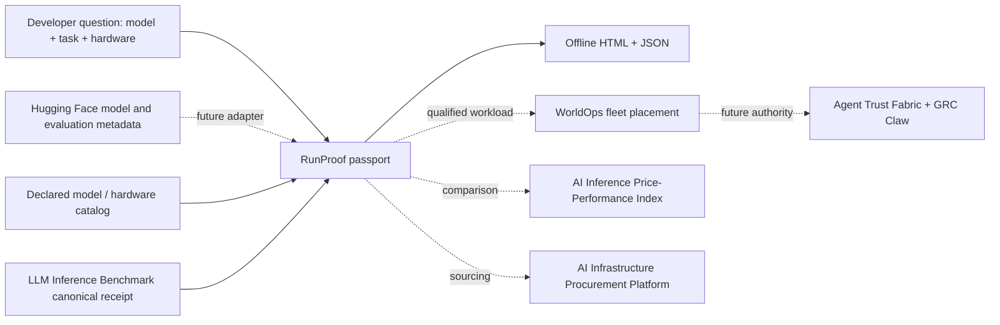

# RunProof

**Can this AI model meet my workload's memory, quality, latency and cost constraints on this hardware?**

RunProof produces an offline, shareable **deployment passport** that separates a formula-based fit estimate from a measured serving result and from independent verification. It is a public entry point for the [WorldOps](https://github.com/AAH20/worldops) infrastructure decision engine and the existing [LLM Inference Benchmark](https://github.com/AAH20/llm-inference-benchmark). It does not claim that a model passing a memory estimate will meet a production SLO.

> **Evidence boundary:** the bundled models, hardware, workload, quality scores and prices are synthetic fixtures. They demonstrate the calculation and user experience; they are not published hardware results or model recommendations. No external API, model download, GPU, account or production system is required to run the example.

## Run the first passport

```bash
PYTHONPATH=src python3 -m runproof.cli \
  --models examples/models.json \
  --hardware examples/hardware.json \
  --workload examples/workload.json \
  --output generated

open generated/index.html  # macOS; or open the file in any browser
PYTHONPATH=src python3 -m unittest discover -s tests -v
```

`generated/passport.json` is the machine-readable artifact. `generated/index.html` is an offline page with model, hardware and status filters. The checked-in [demonstration passport](site/index.html) contains only the synthetic fixture and is published at [aah20.github.io/runproof](https://aah20.github.io/runproof/) when GitHub Pages is enabled.

## What it decides today

| Capability | v0.1 behavior | Boundary |
| --- | --- | --- |
| Memory fit | Weights + modeled full-context KV budget for all concurrent sessions + runtime overhead | Conservative arithmetic using declared inputs, not a hardware benchmark |
| Quality gate | Compare task-specific score with user floor | Scores need disclosed independent evidence before they can support a strong quality claim |
| Serving SLO | Match a canonical benchmark receipt on exact model revision, quantization, hardware, input/output lengths, concurrency, cache state and dataset hash | Receipt is author supplied; SHA-256 checks content integrity, not author identity |
| Economics | Display source receipt cost per successful request | Does not reconstruct cloud bills or full operating costs |
| Ranking | Evidence status first; cost only among eligible measured results | No universal “best model” score |
| Authority | `ADVISORY_ONLY_NOT_AUTHORIZED` on every passport | No deployment or purchase action |

The estimator **does not estimate tokens per second** from a bandwidth heuristic. Real latency and throughput vary with engine, kernel, batching, prefill/decode mix, topology and traffic; those require a run on relevant hardware.

## Bring a benchmark receipt

The input is the canonical JSON produced by [LLM Inference Benchmark](https://github.com/AAH20/llm-inference-benchmark), not raw vLLM console output. Normalize the raw result there, adding `model_revision` to its context, then pass the canonical file here:

```bash
PYTHONPATH=src python3 -m runproof.cli \
  --models examples/models.json --hardware examples/hardware.json \
  --workload examples/workload.json \
  --benchmark /path/to/canonical-result.json --output generated
```

For a candidate to match, its model identifier, revision, quantization, hardware identifier and workload fields must be identical. Changing a receipt after its digest was calculated raises an error. A `measured` provenance flag is **self reported** and never becomes “independently verified” merely because its hash matches. See [evidence and submission contract](docs/EVIDENCE.md).

## Ecosystem architecture



Solid paths are implemented in the first release. Dashed paths are future contracts. RunProof does **not** scrape Hugging Face or claim a live connection to WorldOps. Those integrations need source permission, versioned schemas, tests and actual measured data before being described as operational.

## Public product and commercial layer

The inspectable OSS core includes schemas, CLI, deterministic estimator, exact-match receipt importer, local passport page, fixtures, tests and contribution rules. The public registry should eventually contain opt-in, reproducible results and portable badges tied to model/runtime/hardware/workload revisions.

A commercial service can provide private workload replay, customer-controlled data and topology, continuous regression monitoring, fleet-scale WorldOps planning, procurement evidence, support and service levels. Neither customer prompts nor topology belong in the public registry by default. See the [growth and evaluation plan](docs/GROWTH_AND_EVALUATION.md) for gates before claiming network effects or business value.

## Relationship to related projects

- [WorldOps](https://github.com/AAH20/worldops) evaluates facility and fleet constraints after a candidate deployment is defined.
- [LLM Inference Benchmark](https://github.com/AAH20/llm-inference-benchmark) normalizes runtime measurements; RunProof imports its canonical result.
- [AI Inference Price–Performance Index](https://github.com/AAH20/ai-inference-price-performance-index) compares qualified deployment candidates across providers.
- [AI Infrastructure Procurement Platform](https://github.com/AAH20/ai-infrastructure-procurement-platform) handles buyer requirements and supplier evidence.
- [Audience Swarm Lab](https://github.com/AAH20/audience-swarm-lab) and [Decision World](https://github.com/AAH20/decision-world) can eventually supply demand scenarios, with explicit separation from observed serving data.
- [GRC Claw](https://github.com/AAH20/GRC_Claw) and [Agent Trust Fabric](https://github.com/AAH20/agent-trust-fabric) are future governance and authority handoff targets.

Apache-2.0 licensed. For private benchmarking or deployment planning, see [A2Z SOC](https://a2zsoc.com).
